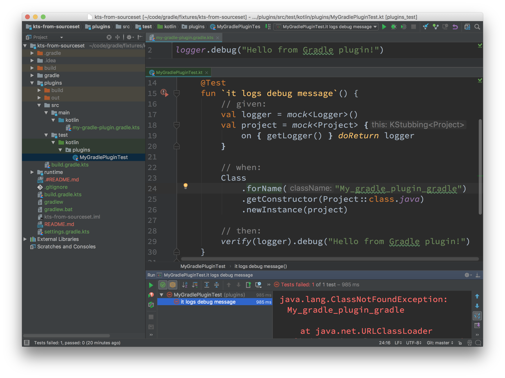

# Precompiled Gradle Kotlin DLS scripts as Gradle plugins

This project demonstrates the first steps towards having Gradle plugins implemented via Kotlin scripts:

  1. the ability to compile `*.gradle.kts` scripts from regular Kotlin sourcesets;
  2. the ability to load the compiled scripts from referencing sourcesets (such as `src/test/kotlin` in this example)

Everything works fine from the command line and the test passes:

    ./gradlew check

    BUILD SUCCESSFUL in 2s
    5 actionable tasks: 5 executed

Unfortunately, running the tests via the IntelliJ IDEA test runner fails with a `java.lang.ClassNotFoundException: My_gradle_plugin_gradle`:

